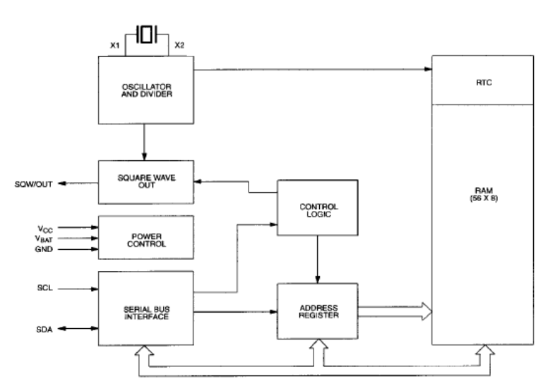

# DS1307_RTC

## DESCRIPCIÓN
El DS1307 Real-Time-Clock Serie, es un dispositivo de bajo consumo de energía,
completo con código binario decimal (BCD), reloj/calendario más 56 bytes de NV SRAM.
Dirección y datos son transferidos a través de 2 hilos serie, bus bi-direccional. El
reloj/calendario provee información de, segundos, minutos, horas, día, fecha, mes y año.
El final de fecha de mes se ajusta automáticamente durante meses menores de 31 días,
incluyendo correcciones para el año bisiesto. El reloj funciona en cualquiera formato de
24 horas o en 12 horas con indicador AM/PM. El DS1307 tiene incorporado un circuito de
sensor de tensión que detecta fallas de energía y cambia automáticamente al suministro
de batería de respaldo. 

## CARACTERÍSTICAS
* Reloj en tiempo real (RTC) Cuenta segundos, Minutos, horas, fecha del mes, mes, día
de la semana, y año con año bisiesto Compensación Válido hasta 2100.
* 56-Byte, con respaldo de batería, no volátil (NV) de RAM para almacenamiento de datos
* Interface Serie I2C.
* Onda-Cuadrada programable de la señal de salida.
* Detector Automático Fallo-Energía y Circuito Conmutación.
* Consume menos de 500nA en la batería -- Modo de copia de seguridad con el oscilador
funcionando.
* Rango de temperatura Industrial Opcional: -40 ° C a +85 ° C
* Disponible en 8-Pin Plástico DIP o SO
* Reconocido Underwriters Laboratory (UL) 

## OPERACION
El DS1307 funciona como un dispositivo esclavo en el bus serie. El acceso se obtiene
mediante la aplicación de una condición de START (Inicio) y la prestación de un código
de identificación del dispositivo seguido de una dirección de registro. Se puede acceder a
registros posteriores de forma secuencial hasta que es ejecutada una condición STOP.
Cuando VCC cae por debajo de 1,25 x VBAT un dispositivo en curso rescinde el acceso y
restablece el contador de dirección de dispositivo. En este momento, pueden no ser
reconocidas entradas al dispositivo para evitar que se escriban datos erróneos en el
dispositivo por fuera de tolerancia del sistema. Cuando VCC cae por debajo de VBAT el
dispositivo conmuta a batería de baja corriente modo de seguridad. Tras el encendido, el
dispositivo conmuta de la batería a VCC VCC cuando es mayor que VBAT + 0,2 V y
reconoce las entradas cuando VCC es mayor de 1,25 x VBAT. El diagrama de bloques de
la Figura 1 muestra los principales elementos del RTC serie.

## DIAGRAMA

## [HOJA DE DATOS](https://www.hispavila.com/wp-content/uploads/2015/08/ds1307_esp.pdf)
